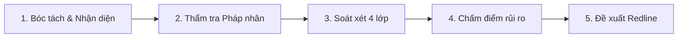

# Kỹ năng Soạn thảo & Thẩm định Hợp đồng

## Khi nào dùng

Kích hoạt khi:
- Người dùng yêu cầu soạn mới dự thảo hợp đồng (liên kết đào tạo, hợp tác doanh nghiệp, cung ứng dịch vụ, chuyển giao phần mềm, MOU/MOA).
- Người dùng gửi một văn bản hợp đồng / phụ lục để rà soát, kiểm tra tính pháp lý hoặc tìm kiếm điều khoản bất lợi.
- Đánh giá rủi ro pháp lý, rủi ro tài chính, rủi ro vận hành trước khi ký kết.
- Chuẩn bị luận điểm đàm phán, viết lại điều khoản (redline) hoặc xây dựng điều khoản mẫu cho nhà trường.

---

## Quy trình 5 bước xử lý hợp đồng

### Bước 1: Tiếp nhận và bóc tách cấu trúc
- Xác định loại hợp đồng: Hợp đồng thương mại, dịch vụ, chuyển giao công nghệ, thỏa thuận liên kết đào tạo theo Luật GDNN.
- Xác định vị thế của nhà trường: Là bên cung cấp dịch vụ/đào tạo (bên nhận tiền) hay bên thuê dịch vụ/đặt hàng (bên trả tiền).

### Bước 2: Thẩm tra tư cách pháp nhân và thẩm quyền ký
- Kiểm tra tên đầy đủ của tổ chức, mã số thuế, trụ sở, tư cách người đại diện.
- Nếu người ký là cấp phó hoặc trưởng bộ phận: Bắt buộc yêu cầu bổ sung văn bản ủy quyền hợp pháp đính kèm.

### Bước 3: Soát xét ma trận 4 lớp điều khoản
1. **Phạm vi & Mô tả công việc**: Tránh thuật ngữ cảm tính; có phụ lục mô tả chi tiết nhiệm vụ và chuẩn đầu ra.
2. **Kinh phí & Tiến độ thanh toán**: Mốc thanh toán phải gắn với biên bản nghiệm thu; quy định rõ thời điểm xuất hóa đơn VAT.
3. **Quyền sở hữu trí tuệ & Bảo mật (NDA)**: Bảo vệ bản quyền bài giảng số, giáo trình, dữ liệu sinh viên/học viên.
4. **Chế tài & Giải quyết tranh chấp**: Phạt vi phạm không quá 8% theo Luật Thương mại; quy định rõ cơ chế bồi thường thiệt hại thực tế; thẩm quyền giải quyết tại Tòa án hoặc Trọng tài (VIAC).
5. **Hai điều khoản bắt buộc của trường (BẮT BUỘC CHÍNH XÁC TỪNG CHỮ MỘT)**:
   - (i) Điều khoản Phòng chống hối lộ, tham nhũng và rửa tiền (Điều 7).
   - (ii) Điều khoản Bảo mật thông tin (Điều 8).
   - Tuyệt đối giữ nguyên văn 100% từng từ, không tóm tắt, không viết lại. Lấy trực tiếp từ `sources/phap-che/hop-dong-thoa-thuan/bieu-mau-chuan/dieu-khoan-bat-buoc-chong-tham-nhung-va-bao-mat.md`. Thiếu hoặc bị đối tác sửa dù chỉ 1 từ lập tức xếp vào Cảnh báo ĐỎ.

### Bước 4: Chấm điểm và phân loại rủi ro (Đỏ - Vàng - Xanh)
- **Rủi ro ĐỎ (Critical)**: Điều khoản trái luật, vô hiệu, vượt thẩm quyền ký, thiếu 1 trong 2 điều khoản bắt buộc của trường, hoặc đẩy toàn bộ rủi ro vô lý sang cho trường.
- **Rủi ro VÀNG (Warning)**: Điều khoản bất lợi, mơ hồ, thiếu thời hạn phản hồi nghiệm thu, bất cân xứng về quyền hủy hợp đồng.
- **Rủi ro XANH (Recommendation)**: Kỹ thuật văn bản, câu từ chưa chặt chẽ, thiếu quy định địa chỉ nhận thông báo.

### Bước 5: Soạn thảo phương án sửa đổi (Redline)
- Đưa ra bảng đối chiếu 3 cột: `Điều khoản hiện tại` -> `Rủi ro nhận diện` -> `Phương án đề xuất sửa đổi (câu chữ cụ thể)`.
- Nêu rõ căn cứ pháp luật điều chỉnh để phục vụ đàm phán với đối tác.

---

## Cấu trúc báo cáo thẩm định chuẩn cho anh Quân

Khi hoàn thành thẩm định một hợp đồng, trình bày theo cấu trúc chuẩn:

1. **Tổng quan văn bản**: Loại hợp đồng, các bên tham gia, giá trị và thời hạn hiệu lực.
2. **Kết luận sơ bộ**: Đánh giá tổng thể mức độ an toàn pháp lý (Có nên ký ngay, cần sửa trước khi ký, hay từ chối).
3. **Bảng tổng hợp rủi ro Đỏ - Vàng - Xanh**:
   - Liệt kê cụ thể từng điều khoản gặp vấn đề.
   - Phân tích rủi ro thực tế có thể xảy ra khi vận hành.
4. **Bảng đề xuất điều khoản sửa đổi (Redline)**: Cung cấp trực tiếp câu chữ có thể copy để gửi sang đối tác.
5. **Khuyến nghị bước tiếp theo**: Các hồ sơ pháp lý cần yêu cầu đối tác cung cấp thêm (ĐKKD, giấy ủy quyền, hồ sơ năng lực).

---

## Lưu ý quan trọng
- Luôn dẫn chiếu chính xác số hiệu văn bản quy phạm pháp luật và điều khoản cụ thể.
- Giữ vững nguyên tắc bảo vệ quyền lợi hợp pháp của Cao đẳng Việt Mỹ Hà Nội và Tập đoàn EQuest.
- Kết thúc báo cáo luôn kèm tuyên bố: Đây là ý kiến tham mưu, rà soát pháp lý nội bộ phục vụ đàm phán, không thay thế văn bản tư vấn pháp lý chính thức của luật sư.
